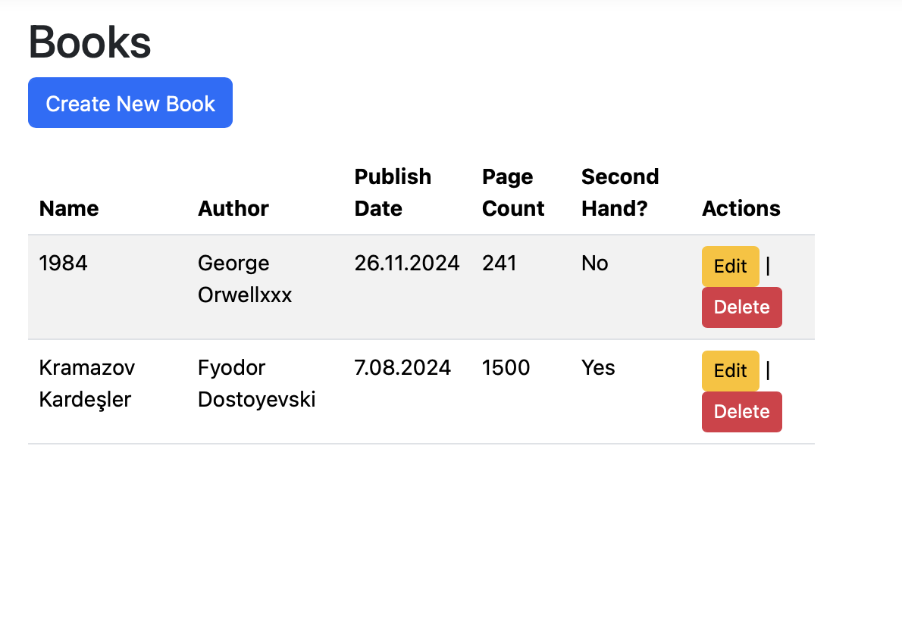
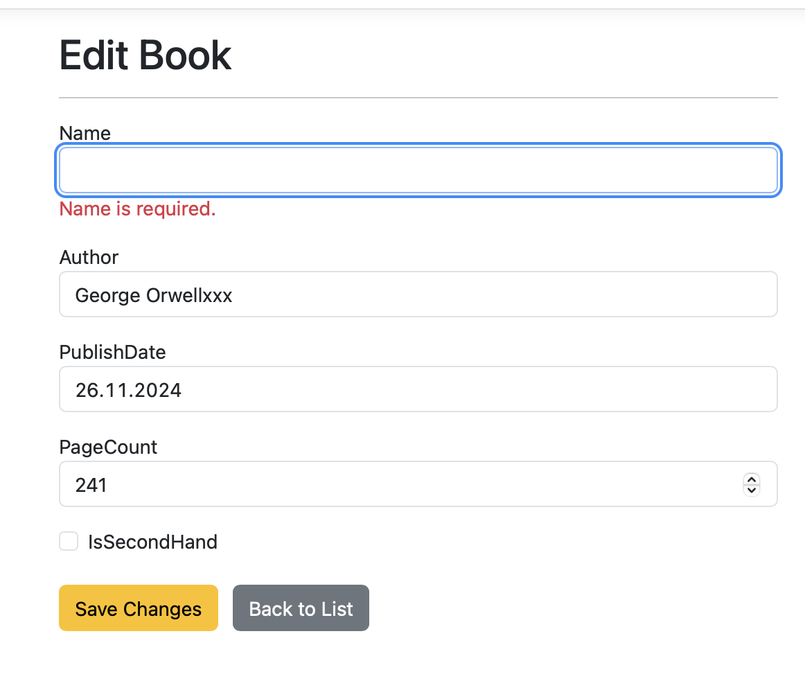

## Assignment: Books CRUD

### What I implemented
In this assignment, a full CRUD (Create, Read, Update, Delete) functionality for a new `Book` entity was manually implemented using ASP.NET Core MVC and Entity Framework Core (Code First). Scaffolding was strictly avoided.

- **List Page:** Displays all books.
- **Create Page:** Allows adding a new book with server-side and client-side validations.
- **Edit/Update Page:** Loads a book's current data, validates inputs, and updates the database. Returns `NotFound` for invalid IDs.
- **Delete Page:** Shows a confirmation screen before permanently deleting a record from the database.

### How to run the project locally
1. Clone this repository to your local machine.
2. Open the project folder in terminal or your preferred IDE (Rider, Visual Studio etc.).
3. Run the following command to start the application:
   `dotnet run`
4. Open web browser and navigate to the local host address provided in the terminal.

### Database/Migration steps
The project uses SQLite as the database. To set up the database and create the `Books` table, open your terminal in the project directory and run:
1. `dotnet ef migrations add AddBookEntity`
2. `dotnet ef database update`

### Screenshots

**1. Books List Page**

**2. Edit Page with Validation Error**

**3. Delete Confirmation Page**
